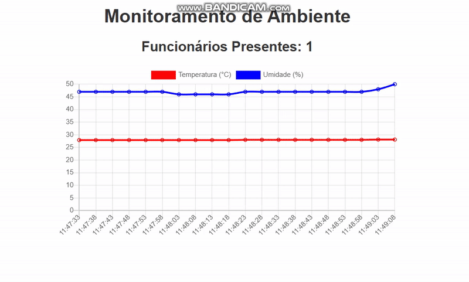
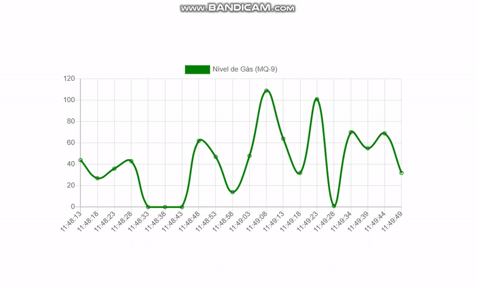

# 🌡️🛂 ESP32 Controle de Acesso e Monitoramento de Temperatura

[](LICENSE)  
[](https://github.com/seu-usuario/seu-repo/issues)  
[](https://github.com/seu-usuario/seu-repo/stargazers)

Este projeto consiste em uma **API de monitoramento de ambiente** (DHT11 para temperatura e umidade, MQ-9 para gás) e um **sistema de controle de acesso RFID**, ambos rodando em um ESP32.  
- 🔥 Monitoramento em tempo real via WebSocket  
- 🚨 Alertas configuráveis (e-mail/SMS)  
- 🗄️ Logging no SPIFFS e MySQL  

## Demonstração

### GIFs de Funcionamento  
<div align="center">
  
  
</div>

> **Nota:** coloque seus arquivos em `/demo` e `/screenshots`.

## Funcionalidades

- **Monitoramento** de temperatura e umidade (DHT11) e gás (MQ-9) em tempo real  
- **Alertas** sonoros, visuais e envio de e-mail/SMS ao ultrapassar limites  
- **Controle de acesso** por RFID, com registro de entrada/saída em MySQL  
- **Webhook** para integração com outros serviços  

## Arquitetura / Stack

| Camada          | Tecnologia                            |
|-----------------|---------------------------------------|
| Firmware ESP32  | Arduino-ESP32                         |
| Backend         | WebSocket, API REST (ESPAsyncWebServer) |
| Banco de dados  | MySQL                                 |
| Frontend        | HTML5, Chart.js                       |
| Autenticação    | RFID RC522                            |

## Como Rodar Localmente

1. Clone o repositório  
   ```bash
   git clone (https://github.com/ZduardoPereira/programa-de-monitoramento-de-ambiente-e-controle-de-acesso.git)
   cd seu-repo
   ```  
2. Abra no Arduino IDE ou PlatformIO  
3. Ajuste credenciais de rede em `config.h` ou no `.ino`:  
   ```c
   const char* ssid     = "SEU_SSID";
   const char* password = "SUA_SENHA";
   // (Opcional) IP estático:
   IPAddress local_IP(192,168,1,184);
   WiFi.config(local_IP, gateway, subnet);
   ```
4. Faça upload para o ESP32  
5. No frontend (`index.html`), ajuste a conexão WebSocket:  
   ```js
   const ws = new WebSocket("ws://<IP_DO_ESP32>:81/");
   ```
6. Acesse no navegador:  
   ```bash
   http://<IP_DO_ESP32>/
   ```

## Uso

### Endpoints da API

| Método | Endpoint     | Descrição                 |
|--------|--------------|---------------------------|
| GET    | `/sensors`   | Retorna dados atuais      |
| POST   | `/alert`     | Configura novo alerta     |
| GET    | `/rfid/logs` | Lista registros de acesso |

### Exemplo com cURL

```bash
curl http://<IP_DO_ESP32>/sensors
```

## Configuração de Sensores

No arquivo `config.h` ou `.ino`, ajuste os pinos:

```c
#define DHTPIN     2    // DHT11
#define DHTTYPE    DHT11
#define MQ9_PIN    35   // MQ-9
#define SS_PIN     4    // RFID RC522 SS
#define RST_PIN    22   // RFID RC522 RST
```

## Ajuste do Frontend

No `index.html`, modifique a URL do WebSocket:

```js
const ws = new WebSocket("ws://<IP_DO_ESP32>:81/");
```


Este projeto está sob a licença MIT. Veja o arquivo [LICENSE](LICENSE) para detalhes.
EOF
